What is the SAGA pattern?
In a microservices architecture, you often need to perform a distributed transaction — a sequence of operations that span multiple services. Traditional ACID transactions (with a single database and rollback) don't work across service boundaries. SAGA is the solution.
A SAGA is a sequence of local transactions. Each local transaction updates data within a single service and publishes an event or message to trigger the next step. If one step fails, the SAGA executes compensating transactions to undo the work done by preceding steps.

   
